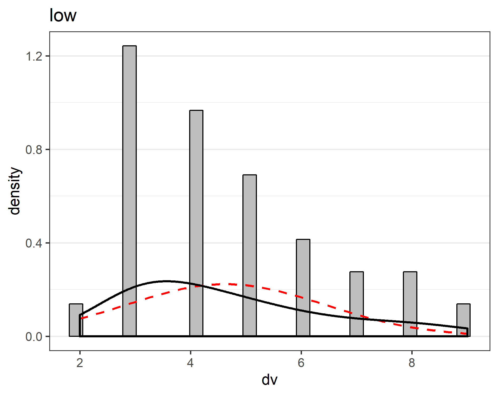

This document summarizes a comparison between two independent groups, comparing answer (1-10) between the high and low conditions. This script can help to facilitate the analysis of data, and the word-output might prevent copy-paste errors when transferring results to a manuscript.

Researchers can base their statistical inferences on Frequentist or robust statistics, as well as on Bayesian statistics. Effect sizes and their confidence intervals are provided, thus inviting researchers to interpret their data from multiple perspectives. 

Checking for outliers, normality, equality of variances.
------

##Outliers

Boxplots can be used to identify outliers. Boxplots give the median (thick line), and 25% of the data above and below the median (box). End of whiskers are the maximum and minimum value when excluding outliers (whih are indicated by dots). 

<!-- -->

##Normality assumption

The independent *t*-test assumes that scores in both groups (high and low) are normally distributed. If the normality assumption is violated, the Type 1 error rate of the test is no longer controlled, and can substantially increase beyond the chosen significance level. Formally, a normality test based on the data is incorrect, and the normality assumption should be tested on additional (e.g., pilot) data. Nevertheless, a two-step procedure (testing the data for normality, and using alternatives for the traditional *t*-test if normality is violated, seems to work well (see [Rochon, Gondan, & Kieser, 2012](http://www.biomedcentral.com/1471-2288/12/81)).

###Tests for normality

Four tests for normality are reported below for both groups. [Yap and Sim (2011, p. 2153)](http://www.tandfonline.com/doi/pdf/10.1080/00949655.2010.520163) recommend: "If the distribution is symmetric with low kurtosis values (i.e. symmetric short-tailed distribution), then the D'Agostino-Pearson and Shapiro-Wilkes tests have good power. For symmetric distribution with high sample kurtosis (symmetric long-tailed), the researcher can use the JB, Shapiro-Wilkes, or Anderson-Darling test." The Kolmogorov-Smirnov (K-S) test is often used, but no longer recommended, and not included here.

If a normality test rejects the assumptions that the data is normally distributed (with *p* < .05) non-parametric or robust statistics have to be used (robust analyses are provided below).  

**The normality assumption was rejected in 0 out of 4 normality tests for the high condition, and in 2 out of 4 normality tests for the low condition.**

Test Name  | *p*-value high  | *p*-value low 
------------- | -------------- | -------------
Shapiro-Wilk  | *p*  =  0.263  |   *p*  =  0.007   
D'Agostino-Pearson  | *p*  =  0.999 |  *p*  =  0.133
Anderson-Darling  | *p*  =  0.095  | *p*  =  0.003    
Jarque-Berra  | *p*  =  0.921 |   *p*  =  0.179

In very large samples (when the test for normality has close to 100% power) tests for normality can result in significant results even when data is normally distributed, based on minor deviations from normality. In very small samples (e.g., n = 10), deviations from normality might not be detected, but this does not mean the data is normally distributed.  Always look at a plot of the data in addition to the test results.

###Histogram, kernel density plot (black line) and normal distribution (red line) of difference scores

The density (or proportion of the observations) is plotted on the y-axis. The grey bars are a histogram of the scores in the two groups. Judging whether data is normally distributed on the basis of a histogram depends too much on the number of bins (or bars) in the graph. A kernel density plot (a non-parametric technique for density estimation) provides an easier way to check the normality of the data by comparing the shape of the density plot (the black line) with a normal distribution (the red dotted line, based on the observed mean and standard deviation). For independent *t*-tests, the dependent variables in both conditions should be normally distributed.

<!-- --><!-- -->

###Q-Q-plot

In the Q-Q plots for the high and low conditions the points should fall on the line. Deviations from the line in the upper and lower quartiles indicates the tails of the distributions are thicker or thinner than in the normal distribution. An S-shaped curve with a dip in the middle indicates data is left-skewed (more values to the right of the distribution), while a bump in the middle indicates data is right-skewed (more values to the left of the distribution). For interpretation examples, see [here](http://emp.byui.edu/BrownD/Stats-intro/dscrptv/graphs/qq-plot_egs.htm).

<!-- -->

###Equal variances assumption

In addition to the normality assumption, a second assumption of Student's *t*-test is that variances in both groups are equal. As [Ruxton (2006)](http://beheco.oxfordjournals.org/content/17/4/688.full) explains: "If you want to compare the central tendency of 2 populations based on samples of unrelated data, then the unequal variance (or Welch's) *t*-test should always be used in preference to the Student's *t*-test or Mann-Whitney U test." This is preferable to the more traditional two-step approach of first testing equality of variances using Levene's test, and then deciding between Student's and Welch's *t*-test. The degrees of freedom for Welch's *t*-test is typically not a round number.

###Levene's test

The equality of variances assumption is typically examined with Levene's test, although as explained above, Welch's test is used below regardless of the outcome. Levene's test for equality of variances (*p*  =  0.37) indicates that the assumption that variances are equal is not rejected.

Comparing the two sets of data
------

Before looking at the results of the Frequentist statistics and the Robust statistics, decide which of these answer the question you are interested in. Choosing between these two options depending on the outcome of the statistical test inflates the Type 1 error rate. You can always report Bayesian statistics.

###Frequentist statistics

A *p*-value is the probability of obtaining the observed result, or a more extreme result, assuming the null-hypothesis is true. It is not the probability that the null-hypothesis or the alternative hypothesis is true (for such inferences, see Bayesian statistics below). In repeated sampling, 95% of future 95% confidence intervals can be expected to contain the true population paramters (e.g, the mean difference or the effect size). Confidence intervals are not a statement about the probability that a single confidence interval contains the true population parameter, but a statement about the probability that future confidence intervals will contain the true population parameter. Hedges' *g* (also referred to as *d*~unbiased~, see Borenstein, Hedges, Higgins, & Rothstein, 2009) is provided as best estimate of Cohen's *d*, but the best estimate of the confidence interval is based on *d* (as recommended by Cumming, 2012). Hedges's *g* and the 95% CI around the effect size are calculated using the MBESS package by ([Kelley (2007](http://dx.doi.org/10.3758/BF03192993)). The common language effect size expresses the probability that in any random pairing of two observations from both groups, the observation from one group is higher than the observation from the other group, see [McGraw & Wong, 1992](http://dx.doi.org/10.1037/0033-2909.111.2.361). Default interpretations of the size of an effect as provided here should only be used as a last resort, and it is preferable to interpret the size of the effect in relation to other effects in the literature, or in terms of its practical significance.

####Results

The mean answer (1-10) of participants in the high condition (*M* = 6.23, *SD* = 1.45, *n* = 30) was greater than the mean of participants in the low condition (*M* = 4.63, *SD* = 1.79, *n* = 30). The difference between the two measurements (*M* = -1.6, 95% CI = [-2.44;-0.76]) was analyzed with Welch's *t*-test, *t*(58) = -3.8, *p*  <  0.001, Hedges' *g* = -0.97, 95% CI [-1.5;-0.43]. This can be considered a large effect. The observed data is surprising under the assumption that the null-hypothesis is true. The Common Language effect size (McGraw & Wong, 1992) indicates that the likelihood that the answer (1-10) of a random person in the high condition is greater than the answer (1-10) of a random person in the low condition is 76%.


###*Figure 1*. Means and 95% CI, and violin plot

<!-- -->

###*Figure 2*. Bar chart displaying means, individual datapoints, and 95% CI

<!-- -->

###*Figure 3*. Bar chart displaying 95% CI

<!-- -->


###References

This script uses the *reshape2* package to convert data from wide to long format, the *PoweR* package to perform the normality tests, *HLMdiag* to create the QQplots, *ggplot2* for all plots, *gtable* and *gridExtra* to combine multiple plots into one, *car* to perform Levene's test, *MBESS* to calculate effect sizes and their confidence intervals, *WRS* for the robust statistics, *bootES* for the robust effect size, *BayesFactor* for the bayes factor, and *BEST* to calculate the Bayesian highest density interval.

Algina, J., Keselman, H. J., & Penfield, R. D. (2005). An alternative to Cohen's standardized mean difference effect size: a robust parameter and confidence interval in the two independent groups case. *Psychological Methods*, *10*, 317-328.

Auguie, B. (2012). *gridExtra: functions in Grid graphics*. R package version 0.9.1, URL: http://CRAN.R-project.org/package=gridExtra.

Baguley, T. (2012). Calculating and graphing within-subject confidence intervals for ANOVA. *Behavior research methods*, *44*, 158-175.

Borenstein, M., Hedges, L. V., Higgins, J. P., & Rothstein, H. R. (2009). *Introduction to meta-analysis*. Hoboken, NJ: Wiley.

Box, G. E. P. (1953). Non-normality and tests on variance. *Biometrika*, *40*, 318-335.

Cumming, G. (2012). *Understanding the new statistics: Effect sizes, confidence intervals, and meta-analysis*. New York: Routledge.

Cohen, J. (1988). *Statistical power analysis for the behavioral sciences (2nd ed.)*. Hillsdale, NJ: Erlbaum.

Fox, J. & Weisberg, S. (2011). *An R Companion to Applied Regression, Second edition*. Sage, Thousand Oaks CA. URL: http://socserv.socsci.mcmaster.ca/jfox/Books/Companion.

Kelley, K. (2005). The effects of nonnormal distributions on confidence intervals around the standardized mean difference: Bootstrap and parametric confidence intervals. *Educational and Psychological Measurement*, *65*, 51-69.

Kelley, K. (2007). Confidence intervals for standardized effect sizes: Theory, application, and implementation. *Journal of Statistical Software*, *20*, 1-24.

Kelley, K. & Lai, K. (2012). *MBESS. R package version 3.3.3*, URL:
http://CRAN.R-project.org/package=MBESS.

Kirby, K. N., & Gerlanc, D. (2013). BootES: An R package for bootstrap confidence intervals on effect sizes. *Behavior Research Methods*, *45*, 905-927.

Kruschke, J. (2010). *Doing Bayesian data analysis: A tutorial introduction with R*. Academic Press.

Kruschke, J. K. (2013). Bayesian estimation supersedes the t-test. *Journal of Experimental Psychology: General*, *142*, 573-603.

Kruschke, J. K., & Meredith, M. (2014). *BEST: Bayesian Estimation Supersedes the t-test*. R package version 0.2.2, URL: http://CRAN.R-project.org/package=BEST.

Lakens, D. (2013). Calculating and reporting effect sizes to facilitate cumulative science: a practical primer for t-tests and ANOVAs. *Frontiers in psychology*, *4*.

Loy, A., & Hofmann, H. (2014). HLMdiag: A Suite of Diagnostics for Hierarchical Linear Models. R. Journal of Statistical Software, 56, pp. 1-28. URL: http://www.jstatsoft.org/v56/i05/.

McGraw, K. O., & Wong, S. P. (1992). A common language effect size statistic. *Psychological Bulletin*, *111*, 361-365.

Micheaux, PLd. & Tran, V. (2012). PoweR. URL: http://www.biostatisticien.eu/PoweR/.

Morey, R. D. (2008). Confidence intervals from normalized data: A correction to Cousineau (2005). *Tutorial in Quantitative Methods for Psychology*, *4*, 61-64.

Morey, R. D. & Rouder, J. N. (2011). Bayes Factor Approaches for Testing Interval Null Hypotheses. *Psychological Methods*, *16*, 406-419

Morey R and Rouder J (2015). *BayesFactor: Computation of Bayes Factors for Common Designs*. R package version 0.9.11-1, URL: http://CRAN.R-project.org/package=BayesFactor.

Rochon, J., Gondan, M., & Kieser, M. (2012). To test or not to test: Preliminary assessment of normality when comparing two independent samples. *BMC Medical Research Methodology*, 12:81.

Rouder, J. N., Speckman, P. L., Sun, D., Morey, R. D., & Iverson, G. (2009). Bayesian t-tests for accepting and rejecting the null hypothesis. *Psychonomic Bulletin & Review*, *16*, 752-760

Ruxton, G. D. (2006). The unequal variance t-test is an underused alternative to Student's t-test and the Mann-Whitney U test. *Behavioral Ecology*, *17*, 688-690.

Wickham, H. (2007). Reshaping Data with the reshape Package. *Journal of Statistical Software*, *21*, pp. 1-20. URL: http://www.jstatsoft.org/v21/i12/.

Wickham, H. (2009). *ggplot2: elegant graphics for data analysis*. Springer New York. ISBN 978-0-387-98140-6, URL: http://had.co.nz/ggplot2/book.

Wickham, H. (2012). *gtable: Arrange grobs in tables*. R package version 0.1.2, URL: http://CRAN.R-project.org/package=gtable.

Wilcox, R. R. (2012). *Introduction to robust estimation and hypothesis testing*. Academic Press.

Wilcox, R. R., & Schönbrodt, F. D. (2015). *The WRS package for robust statistics in R (version 0.27.5)*. URL: https://github.com/nicebread/WRS.

Yap, B. W., & Sim, C. H. (2011). Comparisons of various types of normality tests. *Journal of Statistical Computation and Simulation*, *81*, 2141-2155.


###Apendix A: Data & Session Information


```r
alldata
```

```
##    id dv   iv
## 1   1  6 high
## 2   2  7 high
## 3   3  6 high
## 4   4  9 high
## 5   5  5 high
## 6   6  6 high
## 7   7  4 high
## 8   8  8 high
## 9   9  7 high
## 10 10  6 high
## 11 11  5 high
## 12 12  8 high
## 13 13  7 high
## 14 14  5 high
## 15 15  6 high
## 16 16  6 high
## 17 17  5 high
## 18 18  8 high
## 19 19  9 high
## 20 20  6 high
## 21 21  7 high
## 22 22  5 high
## 23 23  6 high
## 24 24  4 high
## 25 25  5 high
## 26 26  6 high
## 27 27  3 high
## 28 28  7 high
## 29 29  8 high
## 30 30  7 high
## 31 31  3  low
## 32 32  4  low
## 33 33  3  low
## 34 34  3  low
## 35 35  3  low
## 36 36  4  low
## 37 37  3  low
## 38 38  4  low
## 39 39  4  low
## 40 40  4  low
## 41 41  5  low
## 42 42  5  low
## 43 43  3  low
## 44 44  5  low
## 45 45  4  low
## 46 46  3  low
## 47 47  6  low
## 48 48  3  low
## 49 49  2  low
## 50 50  6  low
## 51 51  6  low
## 52 52  7  low
## 53 53  8  low
## 54 54  8  low
## 55 55  7  low
## 56 56  5  low
## 57 57  5  low
## 58 58  9  low
## 59 59  4  low
## 60 60  3  low
```

```r
sessionInfo()
```

```
## R version 3.5.1 (2018-07-02)
## Platform: x86_64-w64-mingw32/x64 (64-bit)
## Running under: Windows 10 x64 (build 17134)
## 
## Matrix products: default
## 
## locale:
## [1] LC_COLLATE=Dutch_Netherlands.1252  LC_CTYPE=Dutch_Netherlands.1252   
## [3] LC_MONETARY=Dutch_Netherlands.1252 LC_NUMERIC=C                      
## [5] LC_TIME=Dutch_Netherlands.1252    
## 
## attached base packages:
## [1] parallel  stats     graphics  grDevices utils     datasets  methods  
## [8] base     
## 
## other attached packages:
## [1] codebook_0.8.0 gridExtra_2.3  gtable_0.2.0   HLMdiag_0.3.1 
## [5] car_3.0-2      carData_3.0-2  ggplot2_3.1.0  PoweR_1.0.7   
## [9] Rcpp_1.0.0    
## 
## loaded via a namespace (and not attached):
##  [1] lattice_0.20-35   assertthat_0.2.0  digest_0.6.18    
##  [4] mime_0.6          R6_2.3.0          cellranger_1.1.0 
##  [7] plyr_1.8.4        labelled_2.0.2    evaluate_0.12    
## [10] pillar_1.3.1      rlang_0.3.1       lazyeval_0.2.1   
## [13] curl_3.3          readxl_1.2.0      rstudioapi_0.9.0 
## [16] minqa_1.2.4       data.table_1.12.0 miniUI_0.1.1.1   
## [19] nloptr_1.2.1      Matrix_1.2-14     rmarkdown_1.11   
## [22] labeling_0.3      splines_3.5.1     lme4_1.1-20      
## [25] stringr_1.4.0     foreign_0.8-70    munsell_0.5.0    
## [28] shiny_1.2.0       compiler_3.5.1    httpuv_1.4.5.1   
## [31] xfun_0.4          pkgconfig_2.0.2   mgcv_1.8-24      
## [34] htmltools_0.3.6   tidyselect_0.2.5  tibble_2.0.1     
## [37] rio_0.5.16        crayon_1.3.4      dplyr_0.7.8      
## [40] withr_2.1.2       later_0.8.0       MASS_7.3-50      
## [43] grid_3.5.1        xtable_1.8-3      nlme_3.1-137     
## [46] magrittr_1.5      scales_1.0.0      zip_1.0.0        
## [49] stringi_1.2.4     reshape2_1.4.3    promises_1.0.1   
## [52] bindrcpp_0.2.2    openxlsx_4.1.0    tools_3.5.1      
## [55] forcats_0.3.0     glue_1.3.0        purrr_0.3.0      
## [58] hms_0.4.2         abind_1.4-5       yaml_2.2.0       
## [61] colorspace_1.4-0  RLRsim_3.1-3      knitr_1.21       
## [64] bindr_0.1.1       haven_2.0.0
```

```r
codebook_data <- alldata

codebook_data <- detect_missing(codebook_data,
    only_labelled = TRUE, # only labelled values are autodetected as
                                   # missing
    negative_values_are_missing = FALSE, # negative values are NOT missing values
    ninety_nine_problems = TRUE,   # 99/999 are missing values, if they
                                   # are more than 5 MAD from the median
    )

codebook(codebook_data)
```

```
## No missing values.
```

```r
knitr::asis_output(data_info)
```


### Metadata

#### Description

```r
if (exists("name", meta)) {
  glue::glue(
    "__Dataset name__: {name}",
    .envir = meta)
}
```

__Dataset name__: codebook_data

```r
cat(description)
```

The dataset has N=60 rows and 3 columns.
60 rows have no missing values on any column.

<details>
<summary title="Expand this section to see some additional metadata in a structured format that is useful for search engines">Metadata for search engines</summary>


- __Date published__: 2019-03-15

```r
meta <- meta[setdiff(names(meta),
                     c("creator", "datePublished", "identifier",
                       "url", "citation", "spatialCoverage", 
                       "temporalCoverage", "description", "name"))]
pander::pander(meta)
```


  * **keywords**: _id_, _dv_ and _iv_

<!-- end of list -->

</details>

```r
knitr::asis_output(survey_overview)
```


## Variables

```r
if (detailed_variables || detailed_scales) {
  knitr::asis_output(paste0(scales_items, sep = "\n\n\n", collapse = "\n\n\n"))
}
```


### id {#id .tabset}


#### Distribution {#id_distribution}

```r
show_missing_values <- FALSE
if (has_labels(item)) {
  missing_values <- item[is.na(haven::zap_missing(item))]
  attributes(missing_values) <- attributes(item)
  if (!is.null(attributes(item)$labels)) {
    attributes(missing_values)$labels <- attributes(missing_values)$labels[is.na(attributes(missing_values)$labels)]
    attributes(item)$labels <- attributes(item)$labels[!is.na(attributes(item)$labels)]
  }
  if (is.double(item)) {
    show_missing_values <- length(unique(haven::na_tag(missing_values))) > 1
    item <- haven::zap_missing(item)
  }
  if (length(item_attributes$labels) == 0 && is.numeric(item)) {
    item <- haven::zap_labels(item)
  }
}
item_nomiss <- item[!is.na(item)]

# unnest mc_multiple and so on
if (
  is.character(item_nomiss) &&
  any(stringr::str_detect(item_nomiss, stringr::fixed(", "))) &&
  !is.null(item_info) &&
  (exists("type", item_info) && 
    any(stringr::str_detect(item_info$type, 
                            pattern = stringr::fixed("multiple"))))
  ) {
  item_nomiss <- unlist(stringr::str_split(item_nomiss, pattern = stringr::fixed(", ")))
}
attributes(item_nomiss) <- attributes(item)

old_height <- knitr::opts_chunk$get("fig.height")
non_missing_choices <- item_attributes[["labels"]]
many_labels <- length(non_missing_choices) > 7
go_vertical <- !is_numeric_or_time_var(item_nomiss) || many_labels
  
if ( go_vertical ) {
  # numeric items are plotted horizontally (because that's what usually expected)
  # categorical items are plotted vertically because we can use the screen real estate better this way

	if (is.null(choices) || 
	    dplyr::n_distinct(item_nomiss) > length(non_missing_choices)) {
		non_missing_choices <- unique(item_nomiss)
		names(non_missing_choices) <- non_missing_choices
	}
  choice_multiplier <- old_height/6.5
	new_height <- 2 + choice_multiplier * length(non_missing_choices)
	new_height <- ifelse(new_height > 20, 20, new_height)
	new_height <- ifelse(new_height < 1, 1, new_height)
	if(could_disclose_unique_values(item_nomiss) && is.character(item_nomiss)) {
	  new_height <- old_height
	}
	knitr::opts_chunk$set(fig.height = new_height)
}

wrap_at <- knitr::opts_chunk$get("fig.width") * 10
```

```r
# todo: if there are free-text choices mingled in with the pre-defined ones, don't show
# todo: show rare items if they are pre-defined
# todo: bin rare responses into "other category"
if (!length(item_nomiss)) {
  cat("No non-missing values to show.")
} else if (!could_disclose_unique_values(item_nomiss)) {
  plot_labelled(item_nomiss, item_name, wrap_at, go_vertical)
} else {
  if (is.character(item_nomiss)) {
      char_count <- stringr::str_count(item_nomiss)
      attributes(char_count)$label <- item_label
      plot_labelled(char_count, 
                    item_name, wrap_at, FALSE, trans = "log1p", "characters")
  } else {
	  cat(dplyr::n_distinct(item_nomiss), " unique, categorical values, so not shown.")
  }
}
```

<!-- -->

```r
knitr::opts_chunk$set(fig.height = old_height)
```

0 missing values.

#### Summary statistics {#id_summary}

```r
attributes(item) <- item_attributes
df = data.frame(item, stringsAsFactors = FALSE)
names(df) = html_item_name
escaped_table(codebook_table(df))
```


name   data_type   missing   complete   n    mean   sd      p0   p25     p50    p75     p100   hist     
-----  ----------  --------  ---------  ---  -----  ------  ---  ------  -----  ------  -----  ---------
id     integer     0         60         60   30.5   17.46   1    15.75   30.5   45.25   60     <U+2587><U+2587><U+2587><U+2587><U+2587><U+2587><U+2587><U+2587> 

```r
if (show_missing_values) {
  plot_labelled(missing_values, item_name, wrap_at)
}
```

```r
if (!is.null(item_info)) {
  # don't show choices again, if they're basically same thing as value labels
  if (!is.null(choices) && !is.null(item_info$choices) && 
    all(names(na.omit(choices)) == item_info$choices) &&
    all(na.omit(choices) == names(item_info$choices))) {
    item_info$choices <- NULL
  }
  item_info$label_parsed <- 
    item_info$choice_list <- item_info$study_id <- item_info$id <- NULL
  pander::pander(item_info)
}
```

```r
if (!is.null(choices) && length(choices) && length(choices) < 30) {
	pander::pander(as.list(choices))
}
```


### dv {#dv .tabset}


#### Distribution {#dv_distribution}

```r
show_missing_values <- FALSE
if (has_labels(item)) {
  missing_values <- item[is.na(haven::zap_missing(item))]
  attributes(missing_values) <- attributes(item)
  if (!is.null(attributes(item)$labels)) {
    attributes(missing_values)$labels <- attributes(missing_values)$labels[is.na(attributes(missing_values)$labels)]
    attributes(item)$labels <- attributes(item)$labels[!is.na(attributes(item)$labels)]
  }
  if (is.double(item)) {
    show_missing_values <- length(unique(haven::na_tag(missing_values))) > 1
    item <- haven::zap_missing(item)
  }
  if (length(item_attributes$labels) == 0 && is.numeric(item)) {
    item <- haven::zap_labels(item)
  }
}
item_nomiss <- item[!is.na(item)]

# unnest mc_multiple and so on
if (
  is.character(item_nomiss) &&
  any(stringr::str_detect(item_nomiss, stringr::fixed(", "))) &&
  !is.null(item_info) &&
  (exists("type", item_info) && 
    any(stringr::str_detect(item_info$type, 
                            pattern = stringr::fixed("multiple"))))
  ) {
  item_nomiss <- unlist(stringr::str_split(item_nomiss, pattern = stringr::fixed(", ")))
}
attributes(item_nomiss) <- attributes(item)

old_height <- knitr::opts_chunk$get("fig.height")
non_missing_choices <- item_attributes[["labels"]]
many_labels <- length(non_missing_choices) > 7
go_vertical <- !is_numeric_or_time_var(item_nomiss) || many_labels
  
if ( go_vertical ) {
  # numeric items are plotted horizontally (because that's what usually expected)
  # categorical items are plotted vertically because we can use the screen real estate better this way

	if (is.null(choices) || 
	    dplyr::n_distinct(item_nomiss) > length(non_missing_choices)) {
		non_missing_choices <- unique(item_nomiss)
		names(non_missing_choices) <- non_missing_choices
	}
  choice_multiplier <- old_height/6.5
	new_height <- 2 + choice_multiplier * length(non_missing_choices)
	new_height <- ifelse(new_height > 20, 20, new_height)
	new_height <- ifelse(new_height < 1, 1, new_height)
	if(could_disclose_unique_values(item_nomiss) && is.character(item_nomiss)) {
	  new_height <- old_height
	}
	knitr::opts_chunk$set(fig.height = new_height)
}

wrap_at <- knitr::opts_chunk$get("fig.width") * 10
```

```r
# todo: if there are free-text choices mingled in with the pre-defined ones, don't show
# todo: show rare items if they are pre-defined
# todo: bin rare responses into "other category"
if (!length(item_nomiss)) {
  cat("No non-missing values to show.")
} else if (!could_disclose_unique_values(item_nomiss)) {
  plot_labelled(item_nomiss, item_name, wrap_at, go_vertical)
} else {
  if (is.character(item_nomiss)) {
      char_count <- stringr::str_count(item_nomiss)
      attributes(char_count)$label <- item_label
      plot_labelled(char_count, 
                    item_name, wrap_at, FALSE, trans = "log1p", "characters")
  } else {
	  cat(dplyr::n_distinct(item_nomiss), " unique, categorical values, so not shown.")
  }
}
```

<!-- -->

```r
knitr::opts_chunk$set(fig.height = old_height)
```

0 missing values.

#### Summary statistics {#dv_summary}

```r
attributes(item) <- item_attributes
df = data.frame(item, stringsAsFactors = FALSE)
names(df) = html_item_name
escaped_table(codebook_table(df))
```


name   data_type   missing   complete   n    mean   sd     p0   p25   p50   p75   p100   hist     
-----  ----------  --------  ---------  ---  -----  -----  ---  ----  ----  ----  -----  ---------
dv     integer     0         60         60   5.43   1.81   2    4     5     7     9      <U+2581><U+2587><U+2586><U+2587><U+2587><U+2585><U+2583><U+2582> 

```r
if (show_missing_values) {
  plot_labelled(missing_values, item_name, wrap_at)
}
```

```r
if (!is.null(item_info)) {
  # don't show choices again, if they're basically same thing as value labels
  if (!is.null(choices) && !is.null(item_info$choices) && 
    all(names(na.omit(choices)) == item_info$choices) &&
    all(na.omit(choices) == names(item_info$choices))) {
    item_info$choices <- NULL
  }
  item_info$label_parsed <- 
    item_info$choice_list <- item_info$study_id <- item_info$id <- NULL
  pander::pander(item_info)
}
```

```r
if (!is.null(choices) && length(choices) && length(choices) < 30) {
	pander::pander(as.list(choices))
}
```


### iv {#iv .tabset}


#### Distribution {#iv_distribution}

```r
show_missing_values <- FALSE
if (has_labels(item)) {
  missing_values <- item[is.na(haven::zap_missing(item))]
  attributes(missing_values) <- attributes(item)
  if (!is.null(attributes(item)$labels)) {
    attributes(missing_values)$labels <- attributes(missing_values)$labels[is.na(attributes(missing_values)$labels)]
    attributes(item)$labels <- attributes(item)$labels[!is.na(attributes(item)$labels)]
  }
  if (is.double(item)) {
    show_missing_values <- length(unique(haven::na_tag(missing_values))) > 1
    item <- haven::zap_missing(item)
  }
  if (length(item_attributes$labels) == 0 && is.numeric(item)) {
    item <- haven::zap_labels(item)
  }
}
item_nomiss <- item[!is.na(item)]

# unnest mc_multiple and so on
if (
  is.character(item_nomiss) &&
  any(stringr::str_detect(item_nomiss, stringr::fixed(", "))) &&
  !is.null(item_info) &&
  (exists("type", item_info) && 
    any(stringr::str_detect(item_info$type, 
                            pattern = stringr::fixed("multiple"))))
  ) {
  item_nomiss <- unlist(stringr::str_split(item_nomiss, pattern = stringr::fixed(", ")))
}
attributes(item_nomiss) <- attributes(item)

old_height <- knitr::opts_chunk$get("fig.height")
non_missing_choices <- item_attributes[["labels"]]
many_labels <- length(non_missing_choices) > 7
go_vertical <- !is_numeric_or_time_var(item_nomiss) || many_labels
  
if ( go_vertical ) {
  # numeric items are plotted horizontally (because that's what usually expected)
  # categorical items are plotted vertically because we can use the screen real estate better this way

	if (is.null(choices) || 
	    dplyr::n_distinct(item_nomiss) > length(non_missing_choices)) {
		non_missing_choices <- unique(item_nomiss)
		names(non_missing_choices) <- non_missing_choices
	}
  choice_multiplier <- old_height/6.5
	new_height <- 2 + choice_multiplier * length(non_missing_choices)
	new_height <- ifelse(new_height > 20, 20, new_height)
	new_height <- ifelse(new_height < 1, 1, new_height)
	if(could_disclose_unique_values(item_nomiss) && is.character(item_nomiss)) {
	  new_height <- old_height
	}
	knitr::opts_chunk$set(fig.height = new_height)
}

wrap_at <- knitr::opts_chunk$get("fig.width") * 10
```

```r
# todo: if there are free-text choices mingled in with the pre-defined ones, don't show
# todo: show rare items if they are pre-defined
# todo: bin rare responses into "other category"
if (!length(item_nomiss)) {
  cat("No non-missing values to show.")
} else if (!could_disclose_unique_values(item_nomiss)) {
  plot_labelled(item_nomiss, item_name, wrap_at, go_vertical)
} else {
  if (is.character(item_nomiss)) {
      char_count <- stringr::str_count(item_nomiss)
      attributes(char_count)$label <- item_label
      plot_labelled(char_count, 
                    item_name, wrap_at, FALSE, trans = "log1p", "characters")
  } else {
	  cat(dplyr::n_distinct(item_nomiss), " unique, categorical values, so not shown.")
  }
}
```

<!-- -->

```r
knitr::opts_chunk$set(fig.height = old_height)
```

0 missing values.

#### Summary statistics {#iv_summary}

```r
attributes(item) <- item_attributes
df = data.frame(item, stringsAsFactors = FALSE)
names(df) = html_item_name
escaped_table(codebook_table(df))
```


name   data_type   ordered   value_labels         missing   complete   n    n_unique   top_counts              
-----  ----------  --------  -------------------  --------  ---------  ---  ---------  ------------------------
iv     factor      FALSE     1. high,<br>2. low   0         60         60   2          hig: 30, low: 30, NA: 0 

```r
if (show_missing_values) {
  plot_labelled(missing_values, item_name, wrap_at)
}
```

```r
if (!is.null(item_info)) {
  # don't show choices again, if they're basically same thing as value labels
  if (!is.null(choices) && !is.null(item_info$choices) && 
    all(names(na.omit(choices)) == item_info$choices) &&
    all(na.omit(choices) == names(item_info$choices))) {
    item_info$choices <- NULL
  }
  item_info$label_parsed <- 
    item_info$choice_list <- item_info$study_id <- item_info$id <- NULL
  pander::pander(item_info)
}
```

```r
if (!is.null(choices) && length(choices) && length(choices) < 30) {
	pander::pander(as.list(choices))
}
```

```r
missingness_report
```


## Missingness report

```r
if (length(md_pattern)) {
  if (knitr::is_html_output()) {
    rmarkdown::paged_table(md_pattern, options = list(rows.print = 10))
  } else {
    knitr::kable(md_pattern)
  }
}
```

```r
items
```


## Codebook table

```r
export_table(metadata_table)
```

<!--html_preserve--><div id="htmlwidget-6ee307f6a6983a42ffdc" style="width:100%;height:auto;" class="datatables html-widget"></div>
<script type="application/json" data-for="htmlwidget-6ee307f6a6983a42ffdc">{"x":{"filter":"top","filterHTML":"<tr>\n  <td data-type=\"character\" style=\"vertical-align: top;\">\n    <div class=\"form-group has-feedback\" style=\"margin-bottom: auto;\">\n      <input type=\"search\" placeholder=\"All\" class=\"form-control\" style=\"width: 100%;\"/>\n      <span class=\"glyphicon glyphicon-remove-circle form-control-feedback\"><\/span>\n    <\/div>\n  <\/td>\n  <td data-type=\"character\" style=\"vertical-align: top;\">\n    <div class=\"form-group has-feedback\" style=\"margin-bottom: auto;\">\n      <input type=\"search\" placeholder=\"All\" class=\"form-control\" style=\"width: 100%;\"/>\n      <span class=\"glyphicon glyphicon-remove-circle form-control-feedback\"><\/span>\n    <\/div>\n  <\/td>\n  <td data-type=\"character\" style=\"vertical-align: top;\">\n    <div class=\"form-group has-feedback\" style=\"margin-bottom: auto;\">\n      <input type=\"search\" placeholder=\"All\" class=\"form-control\" style=\"width: 100%;\"/>\n      <span class=\"glyphicon glyphicon-remove-circle form-control-feedback\"><\/span>\n    <\/div>\n  <\/td>\n  <td data-type=\"character\" style=\"vertical-align: top;\">\n    <div class=\"form-group has-feedback\" style=\"margin-bottom: auto;\">\n      <input type=\"search\" placeholder=\"All\" class=\"form-control\" style=\"width: 100%;\"/>\n      <span class=\"glyphicon glyphicon-remove-circle form-control-feedback\"><\/span>\n    <\/div>\n  <\/td>\n  <td data-type=\"disabled\" style=\"vertical-align: top;\">\n    <div class=\"form-group has-feedback\" style=\"margin-bottom: auto;\">\n      <input type=\"search\" placeholder=\"All\" class=\"form-control\" style=\"width: 100%;\"/>\n      <span class=\"glyphicon glyphicon-remove-circle form-control-feedback\"><\/span>\n    <\/div>\n  <\/td>\n  <td data-type=\"disabled\" style=\"vertical-align: top;\">\n    <div class=\"form-group has-feedback\" style=\"margin-bottom: auto;\">\n      <input type=\"search\" placeholder=\"All\" class=\"form-control\" style=\"width: 100%;\"/>\n      <span class=\"glyphicon glyphicon-remove-circle form-control-feedback\"><\/span>\n    <\/div>\n  <\/td>\n  <td data-type=\"disabled\" style=\"vertical-align: top;\">\n    <div class=\"form-group has-feedback\" style=\"margin-bottom: auto;\">\n      <input type=\"search\" placeholder=\"All\" class=\"form-control\" style=\"width: 100%;\"/>\n      <span class=\"glyphicon glyphicon-remove-circle form-control-feedback\"><\/span>\n    <\/div>\n  <\/td>\n  <td data-type=\"character\" style=\"vertical-align: top;\">\n    <div class=\"form-group has-feedback\" style=\"margin-bottom: auto;\">\n      <input type=\"search\" placeholder=\"All\" class=\"form-control\" style=\"width: 100%;\"/>\n      <span class=\"glyphicon glyphicon-remove-circle form-control-feedback\"><\/span>\n    <\/div>\n  <\/td>\n  <td data-type=\"character\" style=\"vertical-align: top;\">\n    <div class=\"form-group has-feedback\" style=\"margin-bottom: auto;\">\n      <input type=\"search\" placeholder=\"All\" class=\"form-control\" style=\"width: 100%;\"/>\n      <span class=\"glyphicon glyphicon-remove-circle form-control-feedback\"><\/span>\n    <\/div>\n  <\/td>\n  <td data-type=\"character\" style=\"vertical-align: top;\">\n    <div class=\"form-group has-feedback\" style=\"margin-bottom: auto;\">\n      <input type=\"search\" placeholder=\"All\" class=\"form-control\" style=\"width: 100%;\"/>\n      <span class=\"glyphicon glyphicon-remove-circle form-control-feedback\"><\/span>\n    <\/div>\n  <\/td>\n  <td data-type=\"character\" style=\"vertical-align: top;\">\n    <div class=\"form-group has-feedback\" style=\"margin-bottom: auto;\">\n      <input type=\"search\" placeholder=\"All\" class=\"form-control\" style=\"width: 100%;\"/>\n      <span class=\"glyphicon glyphicon-remove-circle form-control-feedback\"><\/span>\n    <\/div>\n  <\/td>\n  <td data-type=\"character\" style=\"vertical-align: top;\">\n    <div class=\"form-group has-feedback\" style=\"margin-bottom: auto;\">\n      <input type=\"search\" placeholder=\"All\" class=\"form-control\" style=\"width: 100%;\"/>\n      <span class=\"glyphicon glyphicon-remove-circle form-control-feedback\"><\/span>\n    <\/div>\n  <\/td>\n  <td data-type=\"character\" style=\"vertical-align: top;\">\n    <div class=\"form-group has-feedback\" style=\"margin-bottom: auto;\">\n      <input type=\"search\" placeholder=\"All\" class=\"form-control\" style=\"width: 100%;\"/>\n      <span class=\"glyphicon glyphicon-remove-circle form-control-feedback\"><\/span>\n    <\/div>\n  <\/td>\n  <td data-type=\"character\" style=\"vertical-align: top;\">\n    <div class=\"form-group has-feedback\" style=\"margin-bottom: auto;\">\n      <input type=\"search\" placeholder=\"All\" class=\"form-control\" style=\"width: 100%;\"/>\n      <span class=\"glyphicon glyphicon-remove-circle form-control-feedback\"><\/span>\n    <\/div>\n  <\/td>\n  <td data-type=\"character\" style=\"vertical-align: top;\">\n    <div class=\"form-group has-feedback\" style=\"margin-bottom: auto;\">\n      <input type=\"search\" placeholder=\"All\" class=\"form-control\" style=\"width: 100%;\"/>\n      <span class=\"glyphicon glyphicon-remove-circle form-control-feedback\"><\/span>\n    <\/div>\n  <\/td>\n  <td data-type=\"character\" style=\"vertical-align: top;\">\n    <div class=\"form-group has-feedback\" style=\"margin-bottom: auto;\">\n      <input type=\"search\" placeholder=\"All\" class=\"form-control\" style=\"width: 100%;\"/>\n      <span class=\"glyphicon glyphicon-remove-circle form-control-feedback\"><\/span>\n    <\/div>\n  <\/td>\n  <td data-type=\"character\" style=\"vertical-align: top;\">\n    <div class=\"form-group has-feedback\" style=\"margin-bottom: auto;\">\n      <input type=\"search\" placeholder=\"All\" class=\"form-control\" style=\"width: 100%;\"/>\n      <span class=\"glyphicon glyphicon-remove-circle form-control-feedback\"><\/span>\n    <\/div>\n  <\/td>\n<\/tr>","extensions":["Buttons"],"data":[["<a href=\"#id\">id<\/a>","<a href=\"#dv\">dv<\/a>","<a href=\"#iv\">iv<\/a>"],["integer","integer","factor"],[null,null,"FALSE"],[null,null,"1. high,<br>2. low"],["0","0","0"],["60","60","60"],["60","60","60"],[null,null,"2"],[null,null,"hig: 30, low: 30, NA: 0"],["30.5 "," 5.43",null],["17.46"," 1.81",null],["1","2",null],["15.75"," 4   ",null],["30.5"," 5  ",null],["45.25"," 7   ",null],["60","9",null],["<U+2587><U+2587><U+2587><U+2587><U+2587><U+2587><U+2587><U+2587>","<U+2581><U+2587><U+2586><U+2587><U+2587><U+2585><U+2583><U+2582>",null]],"container":"<table class=\"display\">\n  <thead>\n    <tr>\n      <th>name<\/th>\n      <th>data_type<\/th>\n      <th>ordered<\/th>\n      <th>value_labels<\/th>\n      <th>missing<\/th>\n      <th>complete<\/th>\n      <th>n<\/th>\n      <th>n_unique<\/th>\n      <th>top_counts<\/th>\n      <th>mean<\/th>\n      <th>sd<\/th>\n      <th>p0<\/th>\n      <th>p25<\/th>\n      <th>p50<\/th>\n      <th>p75<\/th>\n      <th>p100<\/th>\n      <th>hist<\/th>\n    <\/tr>\n  <\/thead>\n<\/table>","options":{"dom":"Bfrtip","buttons":["copy","csv","excel","pdf","print"],"pageLength":200,"order":[],"autoWidth":false,"orderClasses":false,"orderCellsTop":true,"lengthMenu":[10,25,50,100,200]}},"evals":[],"jsHooks":[]}</script><!--/html_preserve-->

```r
jsonld
```


<script type="application/ld+json">
{
  "name": "codebook_data",
  "datePublished": "2019-03-15",
  "description": "The dataset has N=60 rows and 3 columns.\n60 rows have no missing values on any column.\n\n\n## Table of variables\nThis table contains variable names, labels, their central tendencies and other attributes.\n\n|name |data_type |ordered |value_labels    |missing |complete |n  |n_unique |top_counts              |mean |sd    |p0 |p25   |p50  |p75   |p100 |hist     |\n|:----|:---------|:-------|:---------------|:-------|:--------|:--|:--------|:-----------------------|:----|:-----|:--|:-----|:----|:-----|:----|:--------|\n|id   |integer   |NA      |NA              |0       |60       |60 |NA       |NA                      |30.5 |17.46 |1  |15.75 |30.5 |45.25 |60   |<U+2587><U+2587><U+2587><U+2587><U+2587><U+2587><U+2587><U+2587> |\n|dv   |integer   |NA      |NA              |0       |60       |60 |NA       |NA                      |5.43 |1.81  |2  |4     |5    |7     |9    |<U+2581><U+2587><U+2586><U+2587><U+2587><U+2585><U+2583><U+2582> |\n|iv   |factor    |FALSE   |1. high, - 2. low |0       |60       |60 |2        |hig: 30, low: 30, NA: 0 |NA   |NA    |NA |NA    |NA   |NA    |NA   |NA       |\n\n### Note\nThis dataset was automatically described using the [codebook R package](https://rubenarslan.github.io/codebook/) (version 0.8.0).",
  "keywords": ["id", "dv", "iv"],
  "@context": "http://schema.org/",
  "@type": "Dataset",
  "variableMeasured": [
    {
      "name": "id",
      "@type": "propertyValue"
    },
    {
      "name": "dv",
      "@type": "propertyValue"
    },
    {
      "name": "iv",
      "value": "1. high,\n2. low",
      "@type": "propertyValue"
    }
  ]
}
</script>

<details><summary>JSON-LD metadata</summary>
The following JSON-LD can be found by search engines, if you share this codebook
publicly on the web.

```json
{
  "name": "codebook_data",
  "datePublished": "2019-03-15",
  "description": "The dataset has N=60 rows and 3 columns.\n60 rows have no missing values on any column.\n\n\n## Table of variables\nThis table contains variable names, labels, their central tendencies and other attributes.\n\n|name |data_type |ordered |value_labels    |missing |complete |n  |n_unique |top_counts              |mean |sd    |p0 |p25   |p50  |p75   |p100 |hist     |\n|:----|:---------|:-------|:---------------|:-------|:--------|:--|:--------|:-----------------------|:----|:-----|:--|:-----|:----|:-----|:----|:--------|\n|id   |integer   |NA      |NA              |0       |60       |60 |NA       |NA                      |30.5 |17.46 |1  |15.75 |30.5 |45.25 |60   |<U+2587><U+2587><U+2587><U+2587><U+2587><U+2587><U+2587><U+2587> |\n|dv   |integer   |NA      |NA              |0       |60       |60 |NA       |NA                      |5.43 |1.81  |2  |4     |5    |7     |9    |<U+2581><U+2587><U+2586><U+2587><U+2587><U+2585><U+2583><U+2582> |\n|iv   |factor    |FALSE   |1. high, - 2. low |0       |60       |60 |2        |hig: 30, low: 30, NA: 0 |NA   |NA    |NA |NA    |NA   |NA    |NA   |NA       |\n\n### Note\nThis dataset was automatically described using the [codebook R package](https://rubenarslan.github.io/codebook/) (version 0.8.0).",
  "keywords": ["id", "dv", "iv"],
  "@context": "http://schema.org/",
  "@type": "Dataset",
  "variableMeasured": [
    {
      "name": "id",
      "@type": "propertyValue"
    },
    {
      "name": "dv",
      "@type": "propertyValue"
    },
    {
      "name": "iv",
      "value": "1. high,\n2. low",
      "@type": "propertyValue"
    }
  ]
}`
```
</details>


Copyright © 2019 Daniel Lakens

Lakens, D. (2019). The perfect *t*-test. Retrieved
from https://github.com/Lakens/perfect-t-test. doi:10.5281/zenodo.17603

This program is free software: you can redistribute it and/or modify it under the terms of the GNU Affero General Public License as published by the Free Software Foundation, either version 3 of the License, or (at your option) any later version.

This program is distributed in the hope that it will be useful, but WITHOUT ANY WARRANTY; without even the implied warranty of MERCHANTABILITY or FITNESS FOR A PARTICULAR PURPOSE. For more information, see the [GNU Affero General Public License](http://www.gnu.org/licenses/)
